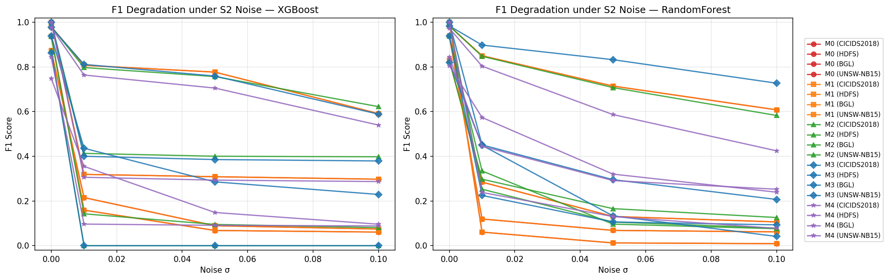

# ER-CyRIS

**Explainable Real-Time Cybersecurity Risk Intelligence System for Organizational Information Systems**


Reproducibility repository for the doctoral dissertation *"Development of the Conceptual Framework ER-CyRIS: Explainable Real-Time Cybersecurity Risk Intelligence System for Organizational Information Systems."* It contains the experiment notebooks, analysis scripts, and result artifacts for all three research cycles.

> **Author:** Fathoni Mahardika · Doctoral Program in Informatics (S3), Universitas Amikom Yogyakarta
> **Promotor:** Prof. Dr. Ema Utami · **Co-Promotors:** Prof. Dr. Kusrini, Dr. Ferry Wahyu Wibowo

---

## Overview

ER-CyRIS integrates three capabilities that are usually treated in isolation:

1. **Hybrid near-real-time anomaly detection** over application-level logs;
2. an **explainability layer** (SHAP) made measurable through a **novel metric, the Feature Stability Score (FSS)**; and
3. an automatic mapping of detection output to **risk levels** following **NIST SP 800-30 Rev. 1** (likelihood × impact).

The central argument is that state-of-the-art machine-learning detectors look near-perfect on benchmark data but are **operationally brittle**. ER-CyRIS repositions the goal from benchmark accuracy to **operational readiness**: detection that is explainable, timely, and connected to actionable risk governance.

---

## Research Design — DSRM (three cycles)

| Cycle | Focus | Core contribution |
|------|-------|-------------------|
| **Cycle 1** | Map & quantify the operational weaknesses (W1–W6) of ML-based IDS via test scenarios **S0–S5** on benchmark datasets. | Evidence that small perturbations collapse performance (noise brittleness, cross-day generalization failure). |
| **Cycle 2** | A context-aware **dual-view** log-preprocessing framework — Structural View (SV) + Contextual Dynamic View (CDV) — with the **FSS** metric and an **M7→M3 feedback loop**. | Novel metric (FSS) + novel architecture. |
| **Cycle 3** | End-to-end validation of ER-CyRIS on real **institutional log data (SIUTER / SIAKAD)** + NIST risk mapping. | Operational, explainable, risk-linked validation. |

---

## Repository Structure

```
ER-CyRIS/
├── TesRM1_CICIDS2018_Final (1).ipynb   # Cycle 1 — S0–S5 weakness mapping on CICIDS2018
├── ER_CyRIS_Siklus2_v4_FINAL.ipynb     # Cycle 2 — dual-view preprocessing + FSS (ablation M0–M4)
├── ER_CyRIS_Siklus3_Fixed2.ipynb       # Cycle 3 — ER-CyRIS validation on SIUTER + NIST risk mapping
└── README.md
```

> This reflects what is actually in the repo today — a flat layout of the three cycle notebooks plus this README. `results/`, `figures/`, `requirements.txt`, and `LICENSE` referenced elsewhere in this document **do not exist yet**; each notebook creates its own `results/` folder at runtime (e.g. `results/all_results_complete.json`) but that output is not currently committed to the repo. Add those files/folders if you want the structure below to be accurate, or let me know and I can generate them (a `requirements.txt` from the imports, and an MIT `LICENSE` file to match the badge above).

---

## Datasets

| Dataset | Role | Features | Size | Attacks | Access |
|---------|------|----------|------|---------|--------|
| **CICIDS2018** (CSE-CIC-IDS2018) | Cycle 1 anchor benchmark | 78 | 330,726 (post-dedup) | 13.62% | Public (Canadian Institute for Cybersecurity) |
| **UNSW-NB15** | Independent benchmark | 42 | 560k / 140k | ≈3.2% | Public (UNSW) |
| **RanSMAP** | Cross-domain benchmark | 5 | 706k / 176k | — | Public |
| **SIUTER (SIAKAD)** | Cycle 3 institutional case study | dual-view (SV+CDV) + augmentation | 33,571 unique entries | 12.31% | **Restricted** — institutional data of Universitas Sebelas April, used under a data-use permission letter |

> The SIUTER institutional dataset is **not redistributed** in this repository due to confidentiality. The notebooks document the preprocessing so the pipeline can be reproduced on equivalent application-level logs.

---

## Requirements & Setup

```bash
git clone https://github.com/Fathoni89/ER-CyRIS.git
cd ER-CyRIS
pip install xgboost shap imbalanced-learn scikit-learn pandas numpy matplotlib tqdm
```

Core libraries: `scikit-learn`, `xgboost`, `imbalanced-learn`, `shap`, `pandas`, `numpy`, `matplotlib`.
The notebooks also run as-is on **Google Colab** (no local setup needed) — each notebook installs its own dependencies in its first cell.

> No `requirements.txt` is committed yet, so the command above lists the packages directly. Pin exact versions once you add one.

---

## How to Reproduce

1. **Cycle 1** — open `TesRM1_CICIDS2018_Final (1).ipynb`, point it to the CICIDS2018 source, and run S0–S5. Outputs: per-scenario metrics, noise/imbalance robustness, cross-day evaluation.
2. **Cycle 2** — open `ER_CyRIS_Siklus2_v4_FINAL.ipynb` to build the dual-view representation and compute FSS (ablation M0–M4).
3. **Cycle 3** — open `ER_CyRIS_Siklus3_Fixed2.ipynb` to run the full pipeline on the institutional logs and produce the NIST risk profile.

All experiments use a fixed seed (`random_state = 42`) for reproducibility.

---

## Key Results (deduplicated, leakage-free)

**Cycle 1 — operational brittleness (CICIDS2018, single seed):**
- Gaussian noise σ = 0.01 reduces F1 by **−68.1% (XGBoost)** and **−93.9% (Random Forest)**.
- **Cross-day generalization collapses to F1 = 0** for the unseen attack family (apparent accuracy 0.9400 masks complete failure on the attack class).

**Cycle 2 — dual-view preprocessing + Feature Stability Score (ablation M0→M4, 4 benchmark datasets):**
- Baseline (M0, S0) detection is strong across all four datasets: F1 = **0.9999 (CICIDS2018, both models)**, **0.9834 (UNSW-NB15, Random Forest)**, **0.9385 (HDFS, Random Forest)**, **0.8726 (BGL, XGBoost)**.
- The full pipeline (M4: dual-view + dynamic token encoding + TOS-KNN/Isolation-Forest augmentation + BorderlineSMOTE) meaningfully improves noise robustness on the weakest cases: Random Forest on BGL goes from **−65.7% F1 drop (M0)** at σ=0.01 to **−28.7% (M4)**; on HDFS from **−87.3% to −47.3%**.
- **Feature Stability Score (FSS)**, the novel explainability metric introduced in this cycle, holds at **100% on BGL across every configuration**, stays **100% on HDFS for M0–M2 and M4** (dipping to 66.7% for Random Forest at M3), and ranges **81.8–100% on CICIDS2018** — i.e., SHAP explanations stay largely consistent even as the architecture changes.
- Honest trade-off: augmentation is not uniformly positive — on BGL, XGBoost's noise robustness briefly collapses to **F1 = 0 at M2/M3** before recovering at M4 with SMOTE rebalancing, and on UNSW-NB15, FSS is noticeably weaker (**42.9–81.8%**) and cross-model SHAP overlap stays modest (**33–54%** throughout), showing the two models don't always agree on *why* a case is flagged.


*Generated from `results/all_results_complete.json` — left: XGBoost, right: Random Forest. The flat line at F1=0 is BGL/XGBoost at M2–M3, the trade-off noted above.*

**Cycle 3 — ER-CyRIS on institutional logs (SIUTER, deduplicated 480,461 → 33,571):**
- Baseline detection F1 = **0.9916 (XGBoost)** / **0.9934 (Random Forest)**.
- Noise degradation milder than benchmark: **−45.78% / −22.77%**.
- Explanation stability **FSS = 81.8% / 100%**.
- **97.4%** of alerts categorized as High / Very High risk under NIST SP 800-30.
- Inference latency in the **millisecond range** (near real-time).

---

## Note on Methodological Rigor (anti-leakage)

During dissertation finalization, all experiments were re-run under a **stricter protocol**: **deduplication to remove train–test leakage**, a unified single-seed protocol, and inference-only latency measurement. As a result, some figures in this repository / dissertation are **more conservative** than those in the earlier published papers — they reveal the *true* extent of the operational weaknesses rather than inflated benchmark scores. **The dissertation figures are the authoritative reference.**

---

## Publications & Citation

The two progress-stage papers have been **accepted**:

- Cycle 1 — *Jurnal MATRIK* (accepted, in press).
- Cycle 1 — *JUTIF (Jurnal Teknik Informatika)* (accepted, in press).

If you use this work, please cite the dissertation:

```bibtex
@phdthesis{mahardika_ercyris_2026,
  author = {Fathoni Mahardika},
  title  = {Development of the Conceptual Framework ER-CyRIS:
            Explainable Real-Time Cybersecurity Risk Intelligence System
            for Organizational Information Systems},
  school = {Universitas Amikom Yogyakarta},
  year   = {2026},
  type   = {Doctoral Dissertation},
  note   = {Code: https://github.com/Fathoni89/ER-CyRIS}
}
```

A permanent **Zenodo DOI** will be minted from a tagged release (`v1.0`) and added here.

---

## License

Code in this repository is intended to be released under the **MIT License**. **No `LICENSE` file is committed yet** — the badge at the top of this README is currently aspirational; add a `LICENSE` file (MIT, Zenodo deposits often expect one) to make it accurate.
The institutional SIUTER/SIAKAD dataset is **excluded** and remains subject to the data owner's confidentiality terms.

---

## Author & Contact

**Fathoni Mahardika** — Doctoral Candidate, Informatics, Universitas Amikom Yogyakarta;
Head of Informatics Study Program, Faculty of Information Technology, Universitas Sebelas April (UNSAP).
GitHub: [@Fathoni89](https://github.com/Fathoni89)

## Acknowledgments

Supervisory team — Prof. Dr. Ema Utami, S.Si.,M.Kom, Prof. Dr. Kusrini, M.Kom, Dr. Ferry Wahyu Wibowo, S.Si.,M.Cs. — and examiner Dr. Andi Sunyoto, M.Kom, M. Hanafi, Ph.D.; and Universitas Sebelas April for institutional data access.
